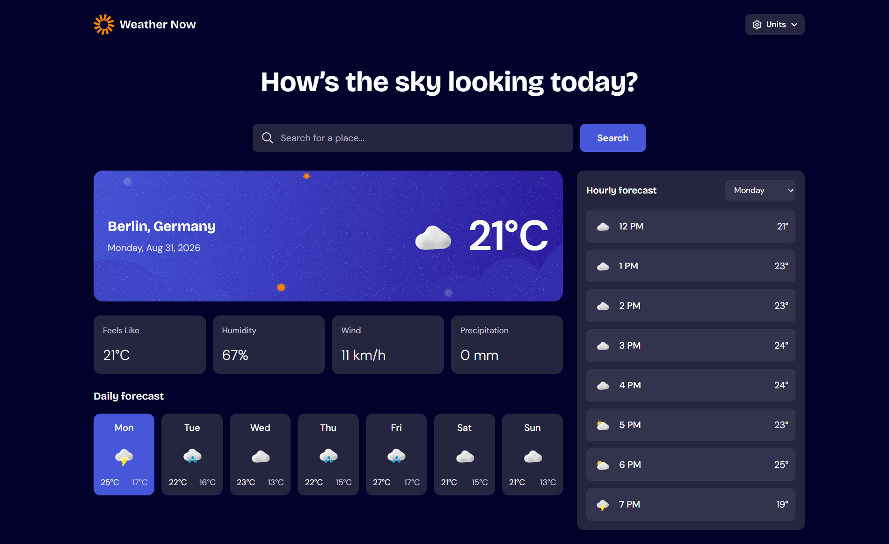
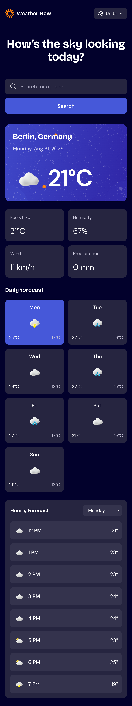

# Weather app challenge by Frontend Mentor

This is a solution to the [Weather app challenge on Frontend Mentor](https://www.frontendmentor.io/challenges/weather-app-K1FhddVm49).

## 📑 Table of contents

- [Overview](#-overview)
  - [The challenge](#-the-challenge)
  - [Screenshots](#-screenshots)
  - [Links](#-links)
- [My process](#️-my-process)
  - [Built with](#-built-with)
  - [What I learned](#-what-i-learned)
  - [Continued development](#-continued-development)
  - [Useful resources](#-useful-resources)
  - [AI collaboration](#-ai-collaboration)
- [Author](#-author)
- [Acknowledgments](#-acknowledgments)

## 🔍 Overview

### 🎯 The challenge

Users should be able to:

- Search for weather information by entering a location
- View the current temperature, weather condition, date, and location
- View feels-like temperature, humidity, wind speed, and precipitation
- Browse a seven-day forecast with daily high and low temperatures
- View an hourly forecast for the selected day
- Switch between days in the hourly forecast
- Toggle between metric and imperial measurement units
- View loading, empty-search, and API error states
- Use the application across mobile and desktop screen sizes
- See hover and focus states for interactive elements

### 📸 Screenshots

#### Desktop view

#### Mobile view

### 🔗 Links

- Solution URL: [Add GitHub repository URL](https://github.com/dulaagamage/weather-app)
- Live Site URL: Add deployed site URL

## ⚙️ My process

### 🛠 Built with

- Semantic HTML5 markup
- React 19
- Vite 8
- Tailwind CSS 4
- JavaScript modules
- Flexbox
- CSS Grid
- Mobile-first workflow
- Open-Meteo Forecast API
- Open-Meteo Geocoding API
- Local variable fonts

### 📚 What I learned

During this challenge, I improved my understanding of:

- Managing related application states with React hooks
- Fetching current, daily, and hourly weather data from an external API
- Searching for locations with a separate geocoding endpoint
- Using `AbortController` to cancel outdated forecast requests
- Handling loading, empty, success, and failure states
- Transforming API response arrays into reusable forecast components
- Sharing selected location, unit, and forecast-day state between components
- Mapping weather codes to accessible descriptions and local icons
- Creating responsive layouts with Tailwind CSS utilities
- Separating components, API services, and utility functions for maintainability

### 🚀 Continued development

In future improvements, I plan to:

- Add a retry button to the API error state
- Save the selected measurement system between visits
- Improve keyboard navigation and focus management in popup controls
- Add automated component and API-layer tests
- Perform more accessibility testing with keyboard and screen-reader tools
- Refine the layout through visual comparison at additional screen sizes

### 🔎 Useful resources

- [Open-Meteo documentation](https://open-meteo.com/en/docs) - Helped identify the current, hourly, daily, and unit parameters required by the application
- [Open-Meteo Geocoding API](https://open-meteo.com/en/docs/geocoding-api) - Provided location-search results and coordinates for forecast requests
- [React documentation](https://react.dev/learn) - Helped with components, state, effects, and rendering patterns
- [Tailwind CSS documentation](https://tailwindcss.com/docs) - Helped create responsive layouts and interactive states with utility classes
- [MDN Fetch API](https://developer.mozilla.org/en-US/docs/Web/API/Fetch_API) - Provided guidance on asynchronous requests and request cancellation

### 🤖 AI collaboration

AI assistance was used primarily for debugging and improving error handling. It helped identify implementation issues, interpret error messages, and review how the application responds to failed API requests and unexpected states. Suggestions were reviewed and tested before being incorporated into the project.

## 👩‍💻 Author

- Frontend Mentor - [@dulaagamage](https://www.frontendmentor.io/profile/dulaagamage)
- GitHub - [@dulaagamage](https://github.com/dulaagamage)
- LinkedIn - [Dulanjalee Gamage](https://www.linkedin.com/in/dulanjalee-gamage-01a7aa207/)

## 🙏 Acknowledgments

Thanks to the Frontend Mentor community for providing the challenge, feedback, and inspiration. Weather and geocoding data are provided by [Open-Meteo](https://open-meteo.com/). 🚀
